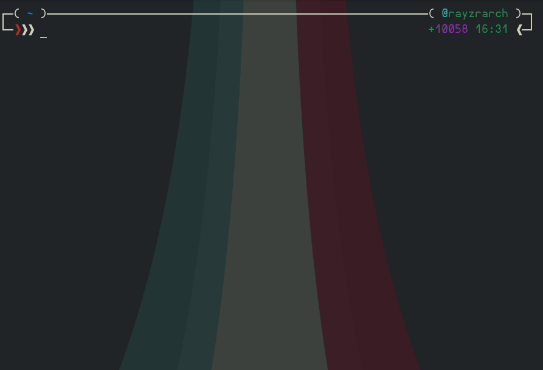

# We no longer provide support for selfbots. They are banned, and that is just the sad, honest truth. This repository is now just for educational purposes.

<h1 align="center">SharpBot</h1>

### Selfbots are officially banned. For more information, see [here](https://github.com/RayzrDev/SharpBot/issues/116#issuecomment-335036210).

**SharpBot** was an ever-expanding [Discord](http://discordapp.com) selfbot powered by [Discord.js](https://discord.js.org/#/) that had a bunch of fun and useful commands. From automating boring tasks with shortcuts to fetching a random cat picture from the internet, SharpBot had it all! Features included Google searching, fetching extended information about users and servers, dice rolls, quoting messages, setting your game, shortening URLs, keeping track of your todo list, embedding messages, generating memes, and so much more. Sadly, none of this is possible anymore due to technical changes in Discord's internals.

## Credits
The bot was originally a modified version of [eslachance's djs-selfbot-v9](https://github.com/eslachance/djs-selfbot-v9), but over time I've completely rewritten it. The commands are a compilation of my own work as well as snippets found online.

## Join Me
If you need help with a bot or just want to chat, you can join my Discord server! If you don't have Discord, don't worry. It only takes a few moments to sign up.

*This README.md has super cow powers.*
