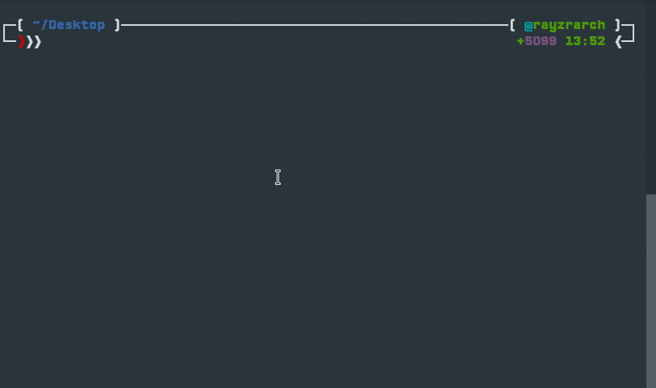

<h1 align="center">SharpBot</h1>

[](https://patreon.com/Rayzr522)
[](https://discord.io/rayzrdevofficial)

**SharpBot** is an ever-expanding [Discord](http://discordapp.com) selfbot powered by [Discord.js](https://discord.js.org/#/) that has a bunch of fun and useful commands. From automating boring tasks with shortcuts to fetching a random cat picture from the internet, SharpBot has it all! Features include Google searching, fetching extended information about users and servers, dice rolls, quoting messages, setting your game, shortening URLs, keeping track of your todo list, embedding messages, generating memes, and so much more!

> Yes, selfbots are officially banned. However, you can see my stance on the topic [here](https://github.com/RayzrDev/SharpBot/issues/116#issuecomment-335036210). 



### [FAQ](docs/FAQ.md)
### [Commands](docs/COMMANDS.md)

#### Table of contents
- [Requirements](#requirements)
- [Installing](#installing)
- [Updating](#updating)
- [Running](#running)
- [Getting your user-token](#getting-your-user-token)
- [Credits](#credits)
- [Join Me](#join-me)

## Usage
### Requirements
- `git` ([Windows](https://git-scm.com/download/win) | [Linux](https://git-scm.com/download/linux) | [macOS](https://git-scm.com/download/mac))
- `node` ([Windows](https://nodejs.org/en/download/current/) | [Linux](https://nodejs.org/en/download/package-manager/) | [macOS](https://nodejs.org/en/download/current/)) (make sure to get v8)
- `yarn` ([Windows](https://yarnpkg.com/en/docs/install#windows-tab) | [Linux](https://yarnpkg.com/en/docs/install#linux-tab) | [macOS](https://yarnpkg.com/en/docs/install#mac-tab))

> If you want a simple reason to use `yarn` instead of `npm`, see [here](https://github.com/RayzrDev/SharpBot/wiki/Why-Yarn%3F).

### Installing
#### Linux & macOS quick-installer
For those of you running Linux/Unix, this nifty little command should do everything for you:

```bash
bash -c "$(curl -fsSL https://rawgit.com/RayzrDev/SharpBot-installer/master/install.sh)"
```

#### Normal installation
Run the following commands in Terminal / Git Bash / Command Prompt:

```bash
# ============================================================
# === DO NOT DOWNLOAD THE BOT AS A ZIP FILE, USE GIT CLONE ===
# ============================================================
# Download the bot
git clone https://github.com/RayzrDev/SharpBot.git
# Enter the bot folder
cd SharpBot
# Install dependencies
yarn install
```

Now run `yarn start` to start the bot. 

**Note:** The first time you start the bot you will enter the setup wizard. It takes just a few seconds to enter the needed information, and it sets up the bot for you.

### Updating
Minor updates can be acquired by running `//exec git pull` in Discord to run the `git pull` command on your computer. Some updates, however, change too much to be updated like that, and instead you must do the following commands in your terminal/command prompt:

```bash
# Go to the SharpBot folder
cd path/to/SharpBot
# Pull in any changes
git pull
# Install new dependencies
yarn install
```

### Running
```bash
# Go to the SharpBot folder
cd path/to/SharpBot
# Start the bot up
yarn start
```

### Getting your user-token
0. Open the Discord application
1. Hit `CTRL+SHIFT+I` (`CMD+ALT+I` on macOS) to bring up the Developers Console
> If you already see the `Application` tab, you can skip step 2
2. At the top, click on the arrow pointing to the right
3. Click `Application`
4. Go to `Local Storage` under the `Storage` section
5. Click on `https://discordapp.com`
6. At the bottom of the list, the last key should be `token`
7. Copy the value on the right side (omitting the quotes)

## Credits
The bot was originally a modified version of [eslachance's djs-selfbot-v9](https://github.com/eslachance/djs-selfbot-v9), but over time I've completely rewritten it. The commands are a compilation of my own work as well as snippets found online.

## Join Me
If you need help with my bot, have a feature to request or just want to chat, you can join my Discord server! If you don't have Discord, don't worry. It only takes a few moments to sign up.

[](https://discord.io/rayzrdevofficial)

*This README.md has super cow powers.*
